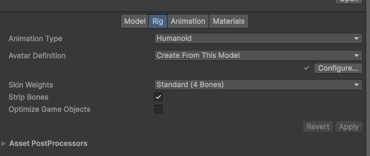

# Importing into Unity
## FBX configuration
When importing the character into Unity:

1. Drag the fbx file to a project folder;
  
2. Select the FBX file Rig tab:
- Animation Type: Humanoid
- Avatar Definition: Create From This Model

3. Click Apply

   

## Validation
1. Click Configure
2. Check:
- Valid avatar (green icon)
- Correct bone mapping
- Fingers recognized correctly

[⬅️ Previous](04-urp-project.md) | [Next ➡️](06-installing-the-sdk.md)
