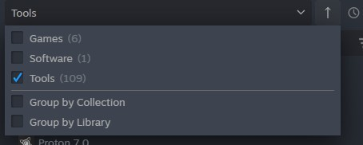
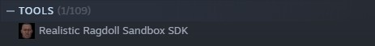
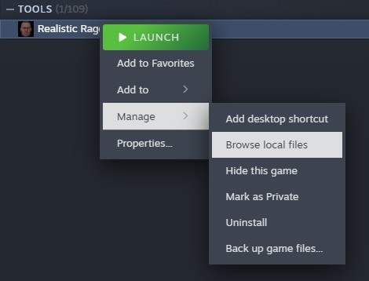
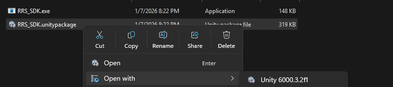
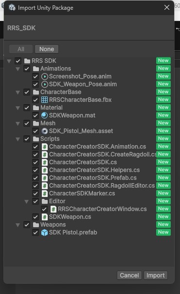

# Importing the SDK into the project
1. In the Steam library, don't forget to add tools to the filters:
   
    

2. Search for Realistic Ragdoll Sandbox SDK and install it:

    

 3. Left-click, select Manage, and then Explore Local Files:

    

4. At this stage, the Unity project must be open. Left-click on the file and open it with Unity:

    

5. In Unity, import the package:

    

[⬅️ Previous](05-importing-into-unity.md) | [Next ➡️](07-using-the-sdk.md)
