# Using the SDK
1. Drag your character into the scene, remembering that texturing is not the responsibility of the SDK. The user must have basic knowledge of Unity:

 

2. To open the SDK, go to RRS/Character Creator:

 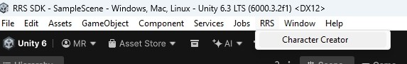
 
3. Drag the character in the scene to the Character field in the SDK and click Next:

 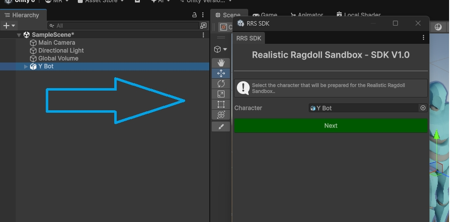

4. Adjust the positions and scales of the ragdoll colliders by clicking on the spheres, turn off symmetry if necessary:

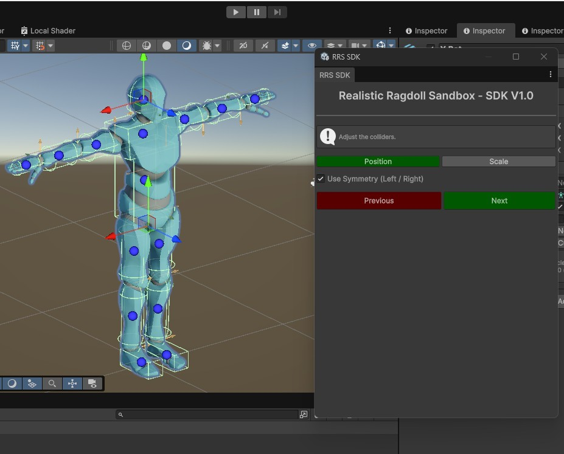

5. Adjust the limits of the ragdoll joints. The yellow axis is the most important. Click on the red spheres to select them and turn off symmetry if necessary:

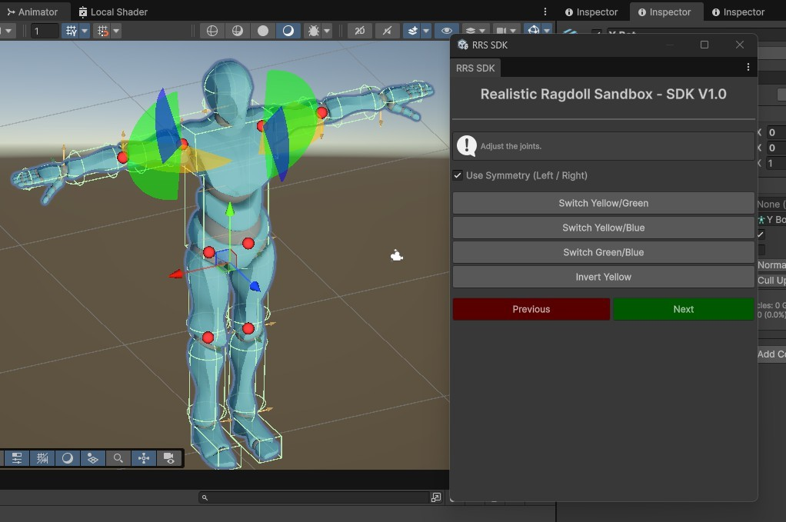

6. Change the axes until they match the following images:

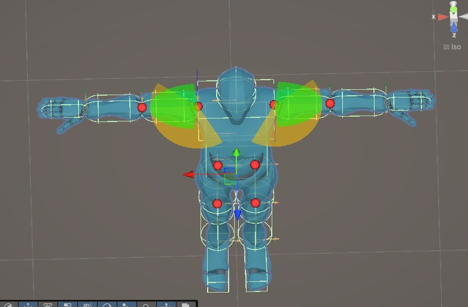

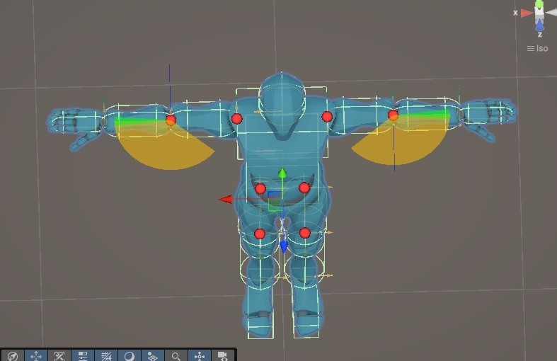

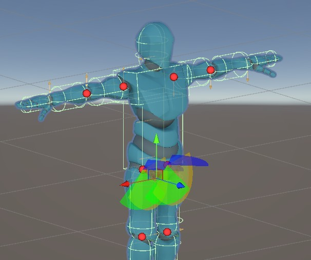

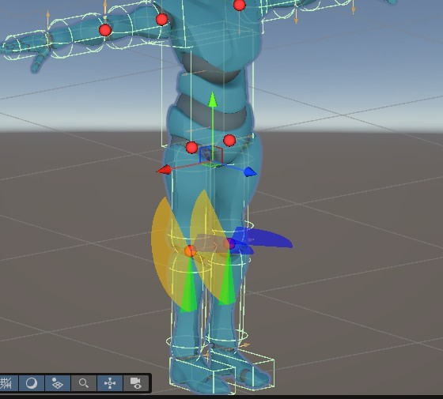

7. Drag the weapon provided with the SDK into the Weapon field:

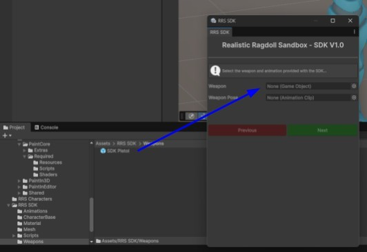

8. Drag the animation provided with the SDK into the Weapon Pose field:

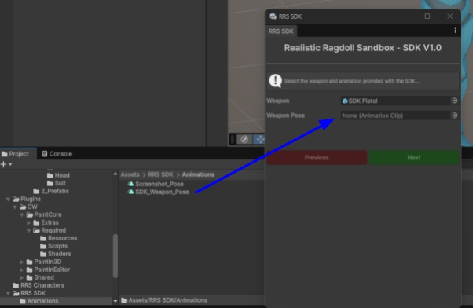

9. Adjust the weapon in the character's hand, click on the sphere to select the weapon, and use the SDK buttons to change its position or rotation:

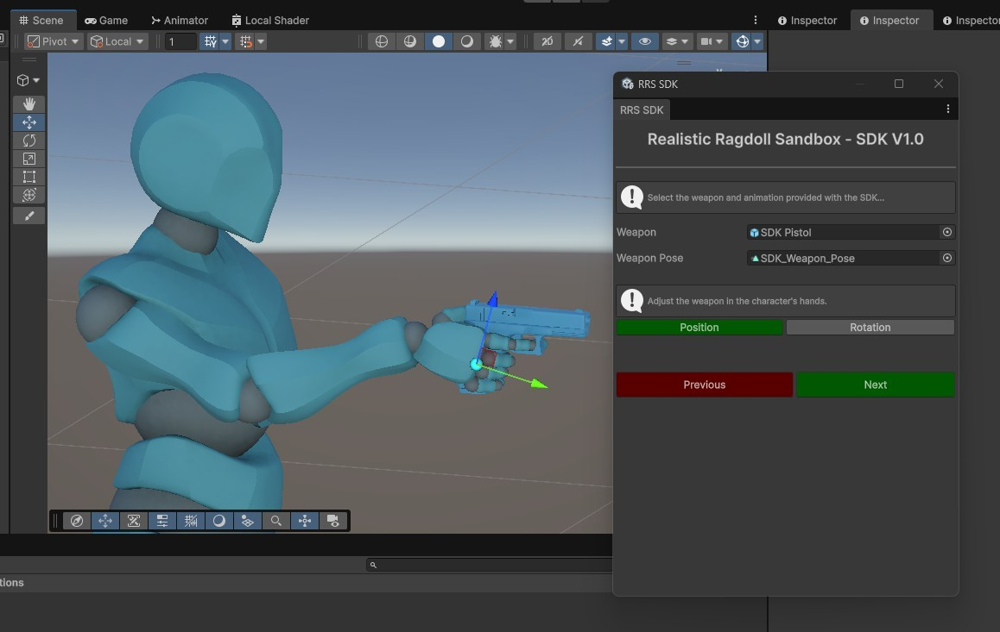

10. Select whether the character is female or not and click Create to create a prefab that will be saved in Assets/RRS_Characters:

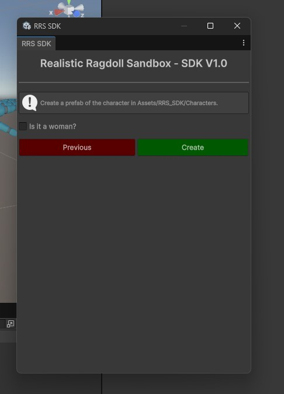

The process may take a while:

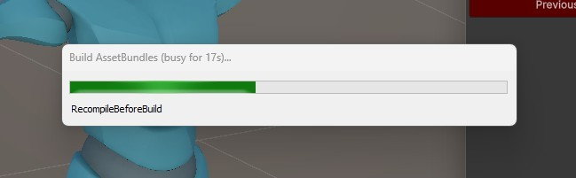

An AssetBundle of the character will be generated in:
Project folder/ Build/ Workshop/ Character name + _ + ID. Do not rename this folder, it will be sent to the Workshop.

Inside this folder, there must be a png file called Preview with dimensions of 512 x 512. There are two options here:
1. Place the desired image in the folder and rename it to Preview.png;
2. Generate the image in the SDK:

Drag a camera from the scene to the camera field:

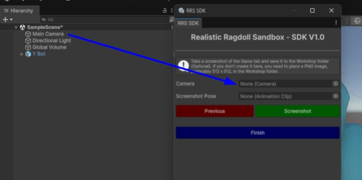

(Optional) Drag the animation provided with the SDK to the Screenshot Pose field:

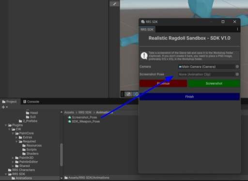

Adjust the camera position and press Screenshot:

The image is now saved in the folder. You can click Finish to complete the Unity part.
 
[⬅️ Previous](06-installing-the-sdk.md) | [Next ➡️](08-workshop-upload.md)

