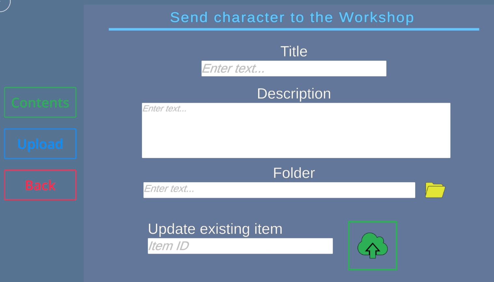
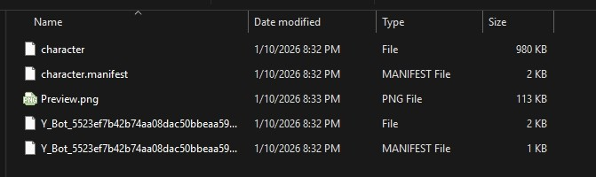
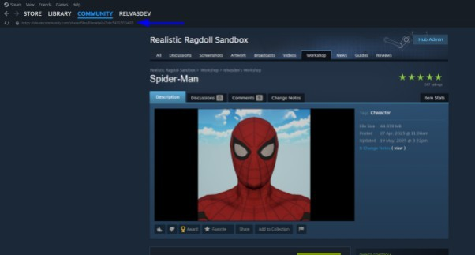
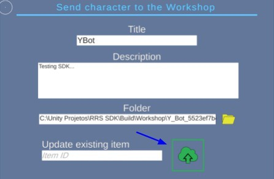
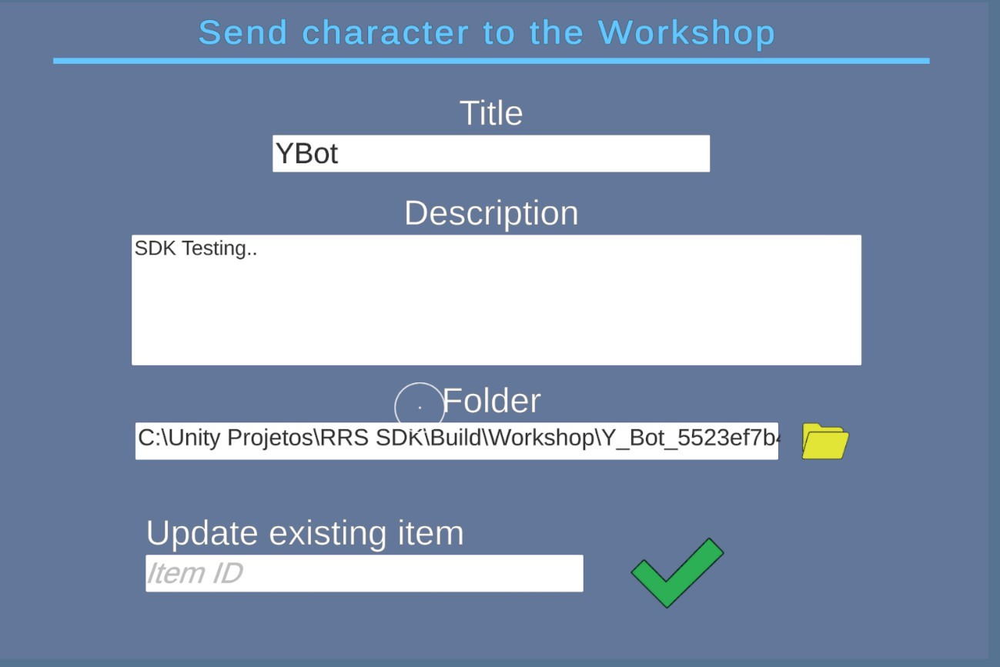

# Sending to the Steam Workshop
## The submission must be made within the Realistic Ragdoll Sandbox game.

1. Go to Workshop/Upload:

2.Enter a title (required) and a description;

3.Select the folder created by the SDK:

4. This should be the folder's content:

5. If it is an update, enter the workshop item ID, which can be found here:

6. Press the button to send to the workshop:

7. If everything is correct, the process will be completed with confirmation that the submission has been completed:

[⬅️ Previous](07-using-the-sdk.md)

